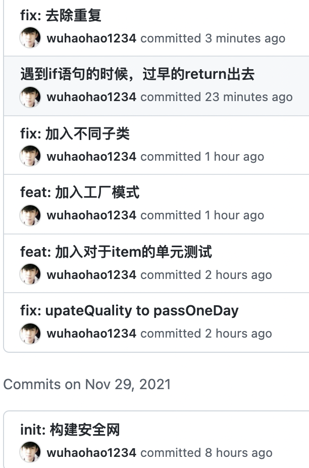

# Gilded Rose

> “镶金玫瑰”重构Kata

具体的看commit

带优化......

This is the Gilded Rose kata in JavaScript with Jest

## Getting started

Install dependencies

```sh
npm install
```

## Running tests

To run all tests

```sh
npm test
```

To run all tests in watch mode

```sh
npm run test:watch
```

To generate test coverage report

```sh
npm run test:coverage
```
